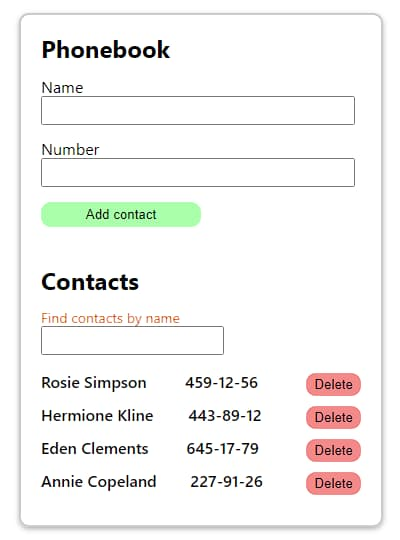

## Додаток "Книга контактів"

## Опис

Це простий додаток "Книга контактів", побудований на React з використанням
React-хуків.

### Основні можливості

- Додавання нового контакту з ім'ям та номером телефону.
- Видалення контакту з телефонної книги.
- Фільтрація контактів за ім'ям.

### Початок роботи

Переконайтеся, що у вас встановлено Node.js та npm (Node Package Manager).

### Встановлення

1. Клонувати репозиторій:
   `git clone https://github.com/your-username/phonebook-app.git`
2. Перейти до папки проекту: `cd phonebook-app`
3. Встановити залежності: `npm install`

### Використання

1. Запустити сервер розробки: `npm start`. Додаток буде запущено і буде
   доступний за адресою http://localhost:3000.

2. Відкрити веб-браузер та перейти за адресою http://localhost:3000, щоб
   переглянути додаток.

### Висновок

Тепер ви успішно розгорнули додаток "Книга контактів" на своєму локальному
комп'ютері. Ви можете взаємодіяти з додатком, додавати нові контакти, видаляти
їх і шукати існуючі контакти.

Насолоджуйтесь використанням.
